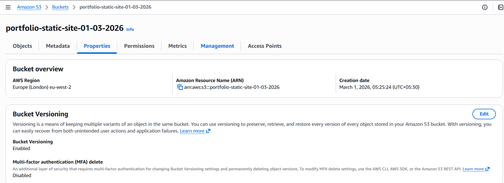
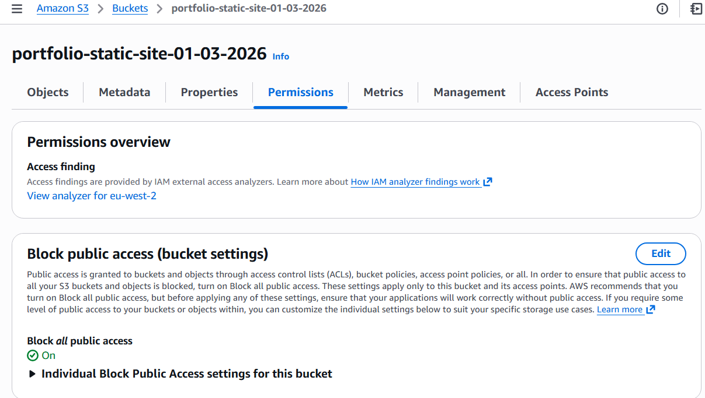
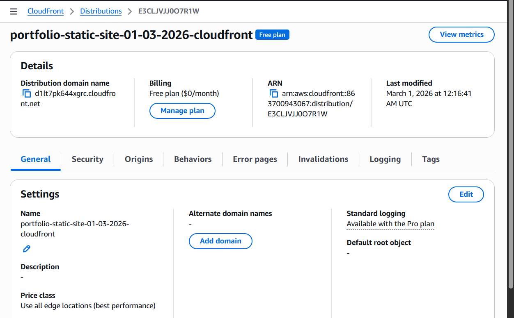
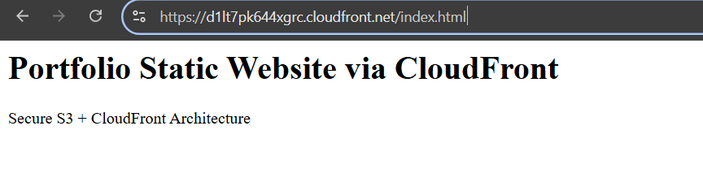
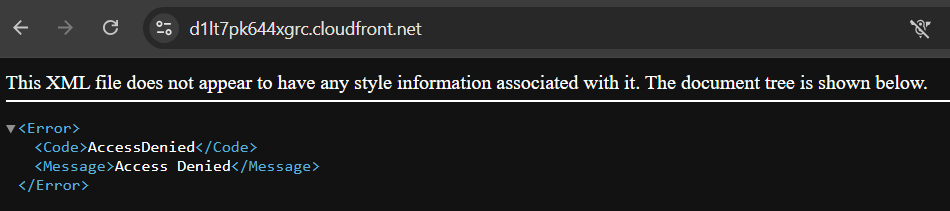
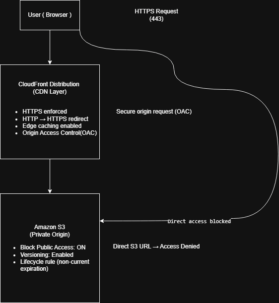

# Portfolio Static Website via CloudFront  
### Secure S3 + CloudFront Architecture

---

## 📌 Architecture Overview

This project demonstrates the deployment of a **static website** using **Amazon S3** for storage and **CloudFront** for **Content Delivery Network (CDN)** functionality.  
The architecture includes secure access to the S3 bucket with **Origin Access Control (OAC)**, **HTTPS redirection**, and **versioning** enabled for the bucket.

---

## 🏗 Architecture Flow

**User → CloudFront → S3 (Private Origin)**  
- **HTTPS Request (443)**
- **HTTPS Enforced** with **HTTP to HTTPS Redirect**  
- **Edge Caching** for fast content delivery  

**Amazon S3 (Private Origin)**  
- **Public access blocked**  
- **Versioning** and **Lifecycle rules** enabled  
- **Origin Access Control** (OAC) used for secure origin requests

---

## 🔹 Key Features

- **Amazon CloudFront** for content delivery
- **S3 bucket** as the private origin
- **Block public access** on S3 for security
- **HTTPS enforced** for secure connections
- **Versioning enabled** for the S3 bucket
- **Lifecycle rule** for non-current expiration

---

## ⚙️ Technical Configuration

### Amazon S3
- **Bucket Name**: portfolio-static-site-01-03-2026
- **Region**: Europe (London) - eu-west-2
- **Versioning**: Enabled
- **Block Public Access**: ON
- **Lifecycle Rule**: Non-current expiration

### CloudFront Distribution
- **Price class**: All edge locations
- **Alternate domain names**: N/A
- **HTTPS**: Enabled with **OAC (Origin Access Control)** for S3
- **HTTP → HTTPS redirect**: Enabled

---

## 📸 Screenshots

- 
- 
- 
- 
- 
- 

---

## 🧠 Architecture Design Principle

- **Private S3 Origin** with no direct public access
- **CloudFront** as the secure, performance-optimized CDN layer
- **Versioning** for data protection and recovery
- **Lifecycle management** for efficient storage cost control
